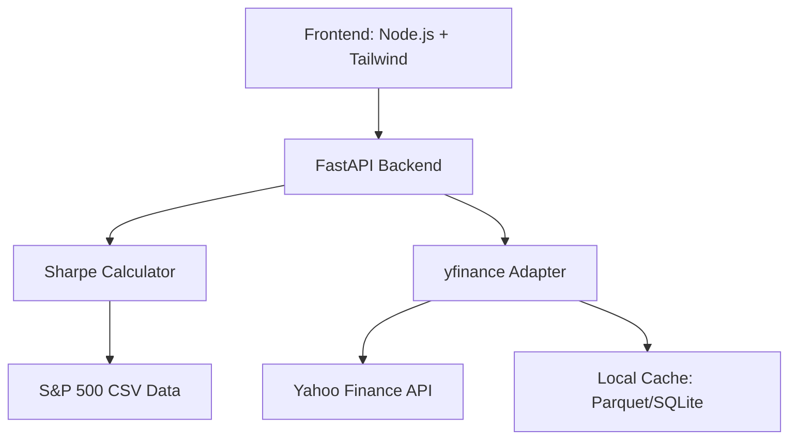

# Top 5 Sharpe Ratio Stocks 📈

> **Demo Project**: Claude Code multi-agent orchestration builds a financial application that identifies the top 5 US stocks by annualized Sharpe ratio using 5-year Yahoo Finance data.

[](LICENSE)
[](https://www.python.org)
[](https://fastapi.tiangolo.com)
[](#kanban-workflow)

## 🎯 Project Overview

This project demonstrates **multi-agent AI development** using Claude Code to build a financial application following strict **Kanban methodology**. The system fetches 5-year daily stock quotes from Yahoo Finance and calculates annualized Sharpe ratios for S&P 500 stocks, presenting the top performers through a responsive web interface.

### Key Features

- 📊 **Real-time Sharpe Ratio Calculation** - Annualized ratios using `mean_daily / std_daily * sqrt(252)`
- 🏦 **S&P 500 Universe** - Deterministic snapshot from embedded CSV data
- ⚡ **Performance Optimized** - In-memory caching with configurable TTL
- 🎨 **Responsive UI** - Sortable tables with SVG sparklines
- 🔄 **Robust Data Fetching** - Exponential backoff retry logic via `yfinance`
- 🛡️ **Production Ready** - Input validation, error handling, observability

## 🏗️ Architecture



### Technology Stack

**Backend**
- **FastAPI** - High-performance async web framework
- **Python 3.9+** - Core runtime
- **yfinance** - Yahoo Finance data adapter
- **Pydantic** - Data validation and serialization
- **SQLite/Parquet** - Local caching layer

**Frontend**
- **Node.js + HTML** - Build-free development
- **Tailwind CSS** - Utility-first styling
- **Vanilla JavaScript** - Lightweight interactions
- **SVG** - Custom sparkline components

**Infrastructure**
- **Docker** - Containerized deployment
- **GitHub Actions** - CI/CD pipeline
- **Make** - Development workflow automation

## 🚀 Quick Start

> **Note**: This project is currently in the planning phase. Implementation follows the structured Kanban workflow described below.

### Expected Commands (Post-Implementation)

```bash
# Development
make dev          # Start development server
make test         # Run test suite
make run          # Production build

# Docker
docker-compose up # Full stack deployment
docker-compose up --build  # Rebuild and start

# API Examples
curl "http://localhost:8000/api/top-stocks?count=5&period=5y&rf=0.015"
curl "http://localhost:8000/api/price-series/AAPL?period=5y"
```

### Environment Configuration

```bash
# .env.sample (to be created)
CACHE_TTL=3600
RISK_FREE_RATE=0.015
LOG_LEVEL=INFO
WARM_CACHE=false
```

## 📋 Kanban Workflow

This project follows a **strict Kanban methodology** with defined WIP limits and pull policies:

### Board Structure
- **Options (Upstream)** - Backlog and expedite placeholders
- **Ready/Committed** - Commitment point with clear acceptance criteria
- **Design/Decompose** (WIP: 2) - System design and task breakdown
- **Build: Generate** (WIP: 3) - Implementation phase
- **Review** (WIP: 2) - Code review and quality assurance
- **Test** (WIP: 2) - Testing and validation
- **Integrate/Release** - Deployment and release management
- **Done** - Completed work

### Classes of Service
- 🚨 **Expedite** - Production hotfixes (reserved placeholder)
- 📅 **FixedDate** - Demo day deliverables
- 📝 **Standard** - Feature development
- 🏛️ **Intangible** - Documentation, governance, CI/CD

### Agent Sequences
Each task follows a defined agent sequence:
- **planner** - `MCP:architect,task-split`
- **data** - Data processing and storage
- **backend** - API and business logic
- **frontend** - User interface development
- **reviewer** - Static analysis and critique
- **tester** - Test authoring and execution
- **devops** - Infrastructure and deployment

## 🎯 API Specification

### Endpoints

#### `GET /health`
Health check endpoint
```json
{
  "status": "ok",
  "version": "0.1.0"
}
```

#### `GET /api/top-stocks`
Returns top N stocks by Sharpe ratio

**Parameters:**
- `count` (int, 1-50): Number of stocks to return (default: 5)
- `period` (str): Data period - `3y` or `5y` (default: `5y`)
- `rf` (float, 0-0.2): Risk-free rate (default: 0.015)
- `universe` (str): Stock universe - `sp500` (default: `sp500`)

**Response:**
```json
{
  "stocks": [
    {
      "ticker": "AAPL",
      "name": "Apple Inc.",
      "sharpe": 1.42,
      "last_price": 175.43,
      "return_1y": 0.234,
      "partial": false
    }
  ],
  "metadata": {
    "period": "5y",
    "risk_free_rate": 0.015,
    "universe": "sp500"
  }
}
```

#### `GET /api/price-series/:ticker`
Returns price series for sparkline generation

**Parameters:**
- `period` (str): Data period (default: `5y`)

**Response:**
```json
{
  "ticker": "AAPL",
  "data": [
    {"date": "2019-01-01", "adj_close": 157.92},
    {"date": "2019-01-02", "adj_close": 158.85}
  ]
}
```

## 📊 Performance Requirements

### API Performance
- **Cold Start**: ≤5 seconds for `/api/top-stocks`
- **Warm Cache**: ≤2 seconds for subsequent requests
- **Sparkline Data**: ≤1 second per ticker

### Frontend Performance
- **Page Load**: ≤3s on 3G, ≤1s on WiFi
- **Bundle Size**: ≤500KB initial, ≤2MB total
- **Rendering**: ≤16ms per frame for 10 sparklines
- **Layout Shift**: Minimal CLS on initial render

### Quality Metrics
- **Test Coverage**: ≥95% for Sharpe utilities, ≥80% overall
- **Lighthouse Scores**: Performance ≥90, Accessibility ≥90
- **Cache Hit Rate**: Monitored and logged
- **Error Rate**: ≤0.1% for critical operations

## 🧪 Testing Strategy

### Unit Tests
- **Sharpe Calculation**: Deterministic and property-based tests
- **Data Validation**: Input/output validation coverage
- **Cache Behavior**: TTL and hit/miss scenarios

### Integration Tests
- **API Endpoints**: Happy path and edge cases
- **Data Pipeline**: End-to-end data flow validation
- **Error Handling**: Timeout and failure scenarios

### Frontend Tests
- **Smoke Tests**: Basic UI functionality
- **Accessibility**: WCAG compliance validation
- **Performance**: Lighthouse audit integration

## 🔒 Security & Compliance

- **No Secrets in Code** - Environment variables only
- **Input Validation** - Comprehensive parameter validation
- **Rate Limiting** - Basic middleware protection
- **Dependency Scanning** - Automated security reviews
- **HTTPS Only** - Production security requirements

## 📊 Data Sources

### S&P 500 Universe Dataset

The application uses a deterministic S&P 500 stock universe from a curated dataset:

- **Source**: [GitHub datasets/s-and-p-500-companies](https://github.com/datasets/s-and-p-500-companies)
- **Origin**: Extracted from Wikipedia's S&P 500 companies list
- **Snapshot Date**: August 2024
- **Format**: CSV with ticker, name, and sector columns
- **Count**: 503 companies (within acceptable range of 500±10)

#### Data Validation
- ✅ **Ticker Format**: Validates against `^[A-Z]{1,5}(\.[A-Z])?$` pattern
- ✅ **Completeness**: All required fields (ticker, name, sector) present
- ✅ **Uniqueness**: No duplicate ticker symbols
- ✅ **Count Range**: Stock count within 490-510 range
- ✅ **Schema Validation**: Proper CSV headers and structure

#### Usage Example
```python
from data.sp500_loader import load_sp500_universe, get_sp500_tickers

# Load all S&P 500 stocks
stocks = load_sp500_universe()
print(f"Loaded {len(stocks)} stocks")

# Get just the ticker symbols
tickers = get_sp500_tickers()
print(f"Tickers: {tickers[:5]}")  # ['MMM', 'AOS', 'ABT', 'ABBV', 'ACN']
```

## 📁 Project Structure

```
top5-sharpe/
├── docs/                    # Documentation
│   ├── demo_plan.md        # Complete Kanban breakdown
│   ├── demo_prompt.md      # Original requirements
│   └── policies.md         # Development policies
├── backend/                 # FastAPI application (planned)
├── frontend/               # UI components (planned)
├── data/                   # S&P 500 universe data
│   ├── sp500.csv           # S&P 500 constituents snapshot
│   └── sp500_loader.py     # Data loader module
├── tests/                  # Test suites
│   └── test_sp500_loader.py    # S&P 500 loader unit tests
├── docker-compose.yml      # Container orchestration (planned)
├── Dockerfile             # Container definition (planned)
├── Makefile              # Development commands (planned)
├── .env.sample           # Environment template (planned)
├── CLAUDE.md             # Claude Code guidance
├── README.md             # This file
└── .gitignore            # Git ignore patterns
```

## 📈 Development Roadmap

### Phase 1: Foundation (Current)
- [x] Project structure and documentation
- [x] Kanban task breakdown
- [x] GitHub repository setup
- [x] S&P 500 universe data and loader
- [ ] Core API data models

### Phase 2: Backend Development
- [ ] FastAPI application scaffold
- [ ] Yahoo Finance adapter with caching
- [ ] Sharpe ratio calculation engine
- [ ] API endpoints with validation

### Phase 3: Frontend Development
- [ ] UI scaffold with Tailwind
- [ ] Data fetching and state management
- [ ] Sortable table component
- [ ] SVG sparkline implementation

### Phase 4: Quality & Deployment
- [ ] Comprehensive test suite
- [ ] Docker containerization
- [ ] CI/CD pipeline
- [ ] Performance optimization

## 🤝 Contributing

This project demonstrates multi-agent AI development workflows. Contributions follow the structured Kanban process defined in [`docs/demo_plan.md`](docs/demo_plan.md).

### Development Guidelines
1. **Follow Kanban WIP limits** - Respect board constraints
2. **Clear acceptance criteria** - Each task has measurable outcomes
3. **Agent-specific roles** - Use appropriate tooling for each phase
4. **Quality gates** - Comprehensive validation before progression
5. **Evidence-based decisions** - Document rationale and metrics

## 📜 License

This project is licensed under the MIT License - see the [LICENSE](LICENSE) file for details.

## 🙏 Acknowledgments

- **Claude Code** - Multi-agent AI development platform
- **Yahoo Finance** - Financial data provider via `yfinance`
- **FastAPI Community** - High-performance web framework
- **Kanban Methodology** - Structured development workflow

---

**Built with ❤️ using Claude Code multi-agent orchestration**