# Top 5 Sharpe Ratio Stocks 📈

> **Demo Project**: Claude Code multi-agent orchestration builds a financial application that identifies the top 5 US stocks by annualized Sharpe ratio using 5-year Yahoo Finance data.

[](LICENSE)
[](https://www.python.org)
[](https://fastapi.tiangolo.com)
[](#kanban-workflow)

## 🎯 Project Overview

This project demonstrates **multi-agent AI development** using Claude Code to build a financial application following strict **Kanban methodology**. The system fetches 5-year daily stock quotes from Yahoo Finance and calculates annualized Sharpe ratios for S&P 500 stocks, presenting the top performers through a responsive web interface.

### Key Features

- 📊 **Real-time Sharpe Ratio Calculation** - Annualized ratios using `mean_daily / std_daily * sqrt(252)`
- 🏦 **S&P 500 Universe** - Deterministic snapshot from embedded CSV data
- ⚡ **Performance Optimized** - In-memory caching with configurable TTL
- 🎨 **Responsive UI** - Sortable tables with SVG sparklines
- 🔄 **Robust Data Fetching** - Exponential backoff retry logic via `yfinance`
- 🛡️ **Production Ready** - Input validation, error handling, observability

## 🏗️ Architecture

### High-Level System Design

```mermaid
graph TD
    A["🌐 Frontend UI<br/>Node.js + Tailwind"] --> B["⚡ FastAPI Backend<br/>Async Request Handler"]
    B --> C["🎯 StockRanker<br/>Orchestration Layer"]
    C --> D["💾 Multi-Tier Cache<br/>Memory → Disk → API"]
    C --> E["📊 YahooFinanceAdapter<br/>Data Fetching + Retry"]
    C --> F["🧮 SharpeCalculator<br/>Vectorized Analytics"]
    E --> G["📈 Yahoo Finance API<br/>Price Data Source"]
    F --> H["🏛️ S&P 500 Universe<br/>Static CSV Dataset"]
    D --> I["💿 Parquet Cache<br/>24h TTL"]
    D --> J["⚡ Memory Cache<br/>5-15min TTL"]
```



### Service Layer Architecture

The system follows a **4-layer architecture** with clear separation of concerns:

```
┌─────────────────────────────────────────────┐
│               API Layer                     │
│  FastAPI • Request Models • Health Monitor  │
└─────────────────────────────────────────────┘
                       ↓
┌─────────────────────────────────────────────┐
│            Business Logic Layer             │
│  StockRanker • PerformanceAnalyzer • Cache │
└─────────────────────────────────────────────┘
                       ↓
┌─────────────────────────────────────────────┐
│               Data Layer                    │
│  YahooAdapter • DataCache • SharpeCalc     │
└─────────────────────────────────────────────┘
                       ↓
┌─────────────────────────────────────────────┐
│           Infrastructure Layer              │
│  Config • Background Workers • Monitoring   │
└─────────────────────────────────────────────┘
```

### Technology Stack

**Backend Services**
- **FastAPI** - High-performance async web framework with OpenAPI docs
- **Python 3.9+** - Core runtime with async/await support
- **aiohttp** - Async HTTP client for external API calls
- **Pydantic** - Data validation, serialization, and API model generation
- **Pandas/NumPy** - Vectorized financial calculations and data processing
- **Parquet** - Columnar storage format for efficient time-series caching

**Data & Analytics**
- **Yahoo Finance API** - Primary price data source via custom adapter
- **Circuit Breaker** - Fault tolerance for external API dependencies
- **Multi-Tier Caching** - Memory (LRU) + Disk (Parquet) + Background refresh
- **Sharpe Ratio Engine** - Vectorized calculations with NaN handling
- **S&P 500 Universe** - Static dataset with 503 validated constituents

**Frontend & UI**
- **Node.js + HTML** - Build-free development with minimal tooling
- **Tailwind CSS** - Utility-first responsive design system
- **Vanilla JavaScript** - Lightweight client-side interactions
- **SVG Sparklines** - Custom price trend visualizations
- **Progressive Enhancement** - Works without JavaScript fallback

**Infrastructure & DevOps**
- **Docker + docker-compose** - Containerized local and production deployment
- **GitHub Actions** - Automated CI/CD with testing and security scanning
- **Make** - Unified development workflow and build automation
- **Health Monitoring** - Cache coverage, API status, performance metrics

## 🚀 Quick Start

> **Note**: This project is currently in the planning phase. Implementation follows the structured Kanban workflow described below.

### Expected Commands (Post-Implementation)

```bash
# Development
make dev          # Start development server
make test         # Run test suite
make run          # Production build

# Docker
docker-compose up # Full stack deployment
docker-compose up --build  # Rebuild and start

# API Examples
curl "http://localhost:8000/api/top-stocks?count=5&period=5y&rf=0.015"
curl "http://localhost:8000/api/price-series/AAPL?period=5y"
```

### Environment Configuration

```bash
# .env.sample (to be created)
CACHE_TTL=3600
RISK_FREE_RATE=0.015
LOG_LEVEL=INFO
WARM_CACHE=false
```

## 📋 Kanban Workflow

This project follows a **strict Kanban methodology** with defined WIP limits and pull policies:

### Board Structure
- **Options (Upstream)** - Backlog and expedite placeholders
- **Ready/Committed** - Commitment point with clear acceptance criteria
- **Design/Decompose** (WIP: 2) - System design and task breakdown
- **Build: Generate** (WIP: 3) - Implementation phase
- **Review** (WIP: 2) - Code review and quality assurance
- **Test** (WIP: 2) - Testing and validation
- **Integrate/Release** - Deployment and release management
- **Done** - Completed work

### Classes of Service
- 🚨 **Expedite** - Production hotfixes (reserved placeholder)
- 📅 **FixedDate** - Demo day deliverables
- 📝 **Standard** - Feature development
- 🏛️ **Intangible** - Documentation, governance, CI/CD

### Agent Sequences
Each task follows a defined agent sequence:
- **planner** - `MCP:architect,task-split`
- **data** - Data processing and storage
- **backend** - API and business logic
- **frontend** - User interface development
- **reviewer** - Static analysis and critique
- **tester** - Test authoring and execution
- **devops** - Infrastructure and deployment

## 🎯 API Specification

### Service Endpoints

#### `GET /health` - System Health Check
Comprehensive health monitoring with cache and external API status
```json
{
  "status": "ok",
  "version": "1.0.0",
  "cache_coverage": 0.85,
  "last_data_update": "2024-01-20T15:30:00Z",
  "external_apis": {
    "yahoo_finance": "healthy",
    "response_time_ms": 245
  },
  "performance": {
    "memory_usage_mb": 156,
    "cache_hit_rate": 0.73,
    "average_response_time_ms": 1247
  }
}
```

#### `GET /api/top-stocks` - Ranked Sharpe Ratio Analysis
Returns top N stocks by risk-adjusted performance with comprehensive metadata

**Request Parameters:**
- `count` (int, 1-50): Number of stocks to return (default: 5)
- `period` (str): Data period - `1y`, `2y`, `5y`, `10y` (default: `5y`)
- `rf` (float, 0.0-0.1): Annual risk-free rate (default: 0.015)
- `universe` (str): Stock universe - `sp500` (default: `sp500`)
- `min_data_years` (int, 1-10): Minimum years of data required (default: 3)

**Response Format:**
```json
{
  "stocks": [
    {
      "ticker": "AAPL",
      "name": "Apple Inc.",
      "sector": "Technology",
      "sharpe_ratio": 1.42,
      "annualized_return": 0.234,
      "volatility": 0.165,
      "data_points": 1260,
      "partial": false,
      "last_updated": "2024-01-20T15:30:00Z"
    }
  ],
  "metadata": {
    "total_analyzed": 503,
    "filtered_out": 45,
    "universe_size": 503,
    "data_freshness": "2024-01-20T15:30:00Z",
    "partial_data_count": 12,
    "request_id": "req-12345"
  },
  "execution_time_ms": 1247,
  "cache_hit_rate": 0.73
}
```

#### `GET /api/price-series/{ticker}` - Time Series Data
Historical price data optimized for sparkline visualization

**Request Parameters:**
- `ticker` (path): Stock symbol (e.g., "AAPL")
- `period` (str): Data period - `1y`, `2y`, `5y` (default: `1y`)

**Response Format:**
```json
{
  "ticker": "AAPL",
  "period": "1y",
  "data": [
    {"date": "2023-01-20", "adj_close": 157.92, "volume": 89234567},
    {"date": "2023-01-21", "adj_close": 159.68, "volume": 65432109}
  ],
  "data_quality": 0.98,
  "data_points": 252,
  "last_updated": "2024-01-20T15:30:00Z"
}
```

**Error Responses:**
```json
// 400 Bad Request - Parameter validation
{
  "error": "Invalid parameter",
  "details": "count must be between 1 and 50",
  "field": "count",
  "timestamp": "2024-01-20T15:30:00Z",
  "request_id": "req-12345"
}

// 503 Service Unavailable - External API issues
{
  "error": "External service unavailable",
  "details": "Yahoo Finance API temporarily unavailable",
  "retry_after_seconds": 60,
  "timestamp": "2024-01-20T15:30:00Z",
  "request_id": "req-12345"
}
```

## 📊 Performance Requirements & Optimization

### API Performance Targets

| Endpoint | Cold Start | Warm Cache | 95th Percentile | Cache Strategy |
|----------|------------|------------|-----------------|----------------|
| `/api/top-stocks` | ≤5s | ≤2s | ≤3s | Memory + Disk + Rankings |
| `/api/price-series` | ≤3s | ≤1s | ≤2s | Memory + Disk Parquet |
| `/health` | N/A | ≤100ms | ≤200ms | Real-time monitoring |

### Multi-Tier Caching Performance

**Cache Hit Performance:**
- **Memory Hit**: ~5ms (Python dict lookup)
- **Disk Hit**: ~50ms (Parquet file read)
- **API Miss**: 2-5s (Yahoo Finance + calculation)

**Target Cache Hit Rates:**
- Overall: ≥70% across all requests
- Peak hours: ≥85% (market hours)
- Off-peak: ≥50% (overnight/weekends)

### Frontend Performance Budget

**Loading Performance:**
- **Initial Page Load**: ≤3s on 3G, ≤1s on WiFi
- **Time to Interactive**: ≤2s after initial load
- **Largest Contentful Paint**: ≤2.5s
- **First Input Delay**: ≤100ms
- **Cumulative Layout Shift**: ≤0.1

**Resource Budgets:**
- **JavaScript Bundle**: ≤200KB initial, ≤500KB total
- **CSS Bundle**: ≤50KB (Tailwind purged)
- **Images/Assets**: ≤100KB total
- **API Response**: ≤50KB typical, ≤200KB maximum

**Rendering Performance:**
- **Sparkline Rendering**: ≤16ms per chart (60fps)
- **Table Sorting**: ≤50ms for 50 rows
- **Data Refresh**: ≤200ms UI update

### System Performance Optimization

**Computational Optimizations:**
- **Vectorized Calculations**: Pandas/NumPy for 10x+ performance
- **Concurrent API Calls**: 10 parallel requests with semaphore
- **Background Cache Warming**: Pre-populate popular stocks
- **Incremental Updates**: Only fetch missing/stale data

**I/O & Storage Optimizations:**
- **HTTP Connection Pooling**: Persistent connections to Yahoo Finance
- **Parquet Format**: 3-5x faster than CSV for time-series data
- **Column-Selective Loading**: Reduce memory usage by 60%
- **Response Compression**: Gzip compression for API responses

**Memory Management:**
- **LRU Cache**: Intelligent eviction of cold data
- **Object Pooling**: Reuse calculation objects
- **Streaming Processing**: Large datasets without memory spikes
- **Memory Monitoring**: Automatic cleanup at 80% usage

### Quality & Reliability Metrics

**Testing Coverage Requirements:**
- **Unit Tests**: ≥95% for financial calculations and utilities
- **Integration Tests**: ≥85% for API endpoints and workflows
- **E2E Tests**: 100% of critical user journeys
- **Property-Based Tests**: Sharpe ratio calculation edge cases

**Lighthouse Performance Targets:**
- **Performance Score**: ≥90 (desktop), ≥80 (mobile)
- **Accessibility Score**: ≥95 (WCAG AA compliance)
- **Best Practices**: ≥90 (security, modern standards)
- **SEO Score**: ≥85 (semantic markup, meta tags)

**Operational Excellence:**
- **Uptime**: ≥99.5% (maximum 36 hours downtime/year)
- **Error Rate**: ≤0.1% for critical operations
- **Mean Time to Recovery**: ≤15 minutes
- **Cache Hit Rate**: Monitored, alerted below 50%

## 🧪 Testing Strategy

### Unit Tests
- **Sharpe Calculation**: Deterministic and property-based tests
- **Data Validation**: Input/output validation coverage
- **Cache Behavior**: TTL and hit/miss scenarios

### Integration Tests
- **API Endpoints**: Happy path and edge cases
- **Data Pipeline**: End-to-end data flow validation
- **Error Handling**: Timeout and failure scenarios

### Frontend Tests
- **Smoke Tests**: Basic UI functionality
- **Accessibility**: WCAG compliance validation
- **Performance**: Lighthouse audit integration

## 🔒 Security & Compliance

- **No Secrets in Code** - Environment variables only
- **Input Validation** - Comprehensive parameter validation
- **Rate Limiting** - Basic middleware protection
- **Dependency Scanning** - Automated security reviews
- **HTTPS Only** - Production security requirements

## 📊 Data Sources

### S&P 500 Universe Dataset

The application uses a deterministic S&P 500 stock universe from a curated dataset:

- **Source**: [GitHub datasets/s-and-p-500-companies](https://github.com/datasets/s-and-p-500-companies)
- **Origin**: Extracted from Wikipedia's S&P 500 companies list
- **Snapshot Date**: August 2024
- **Format**: CSV with ticker, name, and sector columns
- **Count**: 503 companies (within acceptable range of 500±10)

#### Data Validation
- ✅ **Ticker Format**: Validates against `^[A-Z]{1,5}(\.[A-Z])?$` pattern
- ✅ **Completeness**: All required fields (ticker, name, sector) present
- ✅ **Uniqueness**: No duplicate ticker symbols
- ✅ **Count Range**: Stock count within 490-510 range
- ✅ **Schema Validation**: Proper CSV headers and structure

#### Usage Example
```python
from data.sp500_loader import load_sp500_universe, get_sp500_tickers

# Load all S&P 500 stocks
stocks = load_sp500_universe()
print(f"Loaded {len(stocks)} stocks")

# Get just the ticker symbols
tickers = get_sp500_tickers()
print(f"Tickers: {tickers[:5]}")  # ['MMM', 'AOS', 'ABT', 'ABBV', 'ACN']
```

## 📁 Project Structure & Service Organization

```
top5-sharpe/
├── 📚 docs/                              # Architecture & Design Documentation
│   ├── demo_plan.md                      # Complete Kanban task breakdown
│   ├── demo_prompt.md                    # Original requirements specification
│   ├── service_architecture.md           # ✅ 4-layer system design
│   ├── service_contracts.md              # ✅ Interface specifications
│   ├── service_design_summary.md         # ✅ Stakeholder review
│   └── policies.md                       # Development policies
├── 🔧 backend/ (planned)                 # FastAPI Application Layer
│   ├── app/
│   │   ├── api/                          # FastAPI routers and endpoints
│   │   ├── services/                     # Business logic layer
│   │   │   ├── stock_ranker.py          # Orchestration service
│   │   │   ├── performance_analyzer.py   # Sharpe calculation service
│   │   │   └── cache_manager.py         # Multi-tier cache coordination
│   │   ├── adapters/                    # Data layer interfaces
│   │   │   ├── yahoo_finance_adapter.py # External API integration
│   │   │   ├── data_cache.py           # Cache implementation
│   │   │   └── sharpe_calculator.py    # Analytics utilities
│   │   ├── models/                      # Pydantic data models
│   │   └── config/                      # Configuration management
│   ├── requirements.txt                 # Python dependencies
│   └── Dockerfile                       # Container definition
├── 🎨 frontend/ (planned)               # UI Component Layer
│   ├── src/
│   │   ├── components/                  # UI components
│   │   ├── services/                    # API client services
│   │   └── styles/                      # Tailwind CSS
│   ├── public/                         # Static assets
│   └── package.json                    # Node.js dependencies
├── 🗄️ data/                            # S&P 500 Universe Dataset
│   ├── sp500.csv                       # ✅ 503 constituents snapshot
│   └── sp500_loader.py                 # ✅ Data loader with validation
├── ✅ tests/                           # Comprehensive Test Suite
│   ├── unit/                           # Unit tests (95% coverage target)
│   ├── integration/                    # API and workflow tests
│   ├── e2e/                           # End-to-end user journeys
│   └── test_sp500_loader.py           # ✅ S&P 500 loader tests
├── 🐳 Infrastructure & Deployment
│   ├── docker-compose.yml              # Container orchestration
│   ├── docker-compose.dev.yml          # Development environment
│   ├── .github/workflows/               # CI/CD automation
│   └── deployment/                      # Production deployment configs
├── 🔧 Development Tooling
│   ├── Makefile                        # Unified development commands
│   ├── .env.sample                     # Environment configuration template
│   ├── requirements-dev.txt            # Development dependencies
│   └── pyproject.toml                  # Python project configuration
├── 📋 Project Documentation
│   ├── CLAUDE.md                       # Claude Code guidance
│   ├── README.md                       # This comprehensive guide
│   ├── LICENSE                         # MIT license
│   └── .gitignore                      # Git ignore patterns
└── 💾 Cache & Data Storage (runtime)
    ├── cache/                          # Multi-tier cache storage
    │   ├── memory/                     # In-process cache (200 entries)
    │   ├── disk/                       # Parquet file cache (24h TTL)
    │   └── rankings/                   # Pre-computed result cache
    └── logs/                           # Application logs
```

### Service Layer Organization

**API Layer** (`backend/app/api/`)
- FastAPI routers with async/await support
- Request/response models with Pydantic validation
- Error handling middleware and rate limiting
- OpenAPI documentation generation

**Business Logic Layer** (`backend/app/services/`)
- `StockRanker`: Main orchestration service
- `PerformanceAnalyzer`: Sharpe ratio calculations
- `CacheManager`: Multi-tier cache coordination

**Data Layer** (`backend/app/adapters/`)
- `YahooFinanceAdapter`: External API integration
- `DataCache`: Memory + disk storage implementation
- `SharpeCalculator`: Vectorized analytics utilities

**Infrastructure Layer**
- Configuration management and dependency injection
- Background workers for cache warming
- Monitoring, logging, and health check systems

## 📈 Development Roadmap

### Phase 1: Foundation (Current)
- [x] Project structure and documentation
- [x] Kanban task breakdown
- [x] GitHub repository setup
- [x] S&P 500 universe data and loader
- [ ] Core API data models

### Phase 2: Backend Development
- [ ] FastAPI application scaffold
- [ ] Yahoo Finance adapter with caching
- [ ] Sharpe ratio calculation engine
- [ ] API endpoints with validation

### Phase 3: Frontend Development
- [ ] UI scaffold with Tailwind
- [ ] Data fetching and state management
- [ ] Sortable table component
- [ ] SVG sparkline implementation

### Phase 4: Quality & Deployment
- [ ] Comprehensive test suite
- [ ] Docker containerization
- [ ] CI/CD pipeline
- [ ] Performance optimization

## 🤝 Contributing

This project demonstrates multi-agent AI development workflows. Contributions follow the structured Kanban process defined in [`docs/demo_plan.md`](docs/demo_plan.md).

### Development Guidelines
1. **Follow Kanban WIP limits** - Respect board constraints
2. **Clear acceptance criteria** - Each task has measurable outcomes
3. **Agent-specific roles** - Use appropriate tooling for each phase
4. **Quality gates** - Comprehensive validation before progression
5. **Evidence-based decisions** - Document rationale and metrics

## 📜 License

This project is licensed under the MIT License - see the [LICENSE](LICENSE) file for details.

## 🙏 Acknowledgments

- **Claude Code** - Multi-agent AI development platform
- **Yahoo Finance** - Financial data provider via `yfinance`
- **FastAPI Community** - High-performance web framework
- **Kanban Methodology** - Structured development workflow

---

**Built with ❤️ using Claude Code multi-agent orchestration**