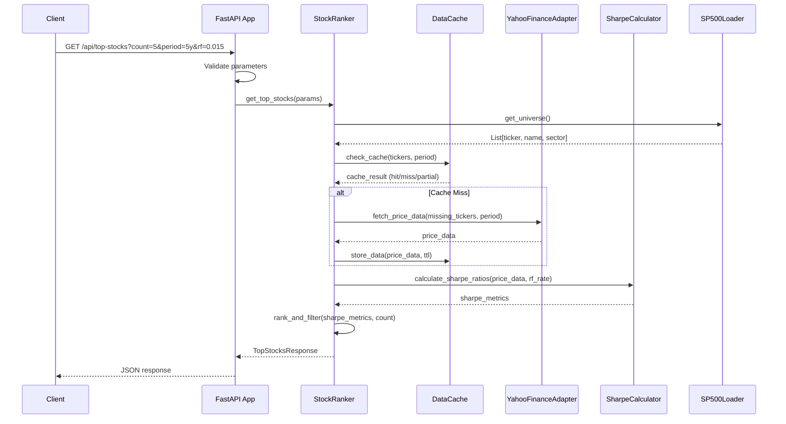
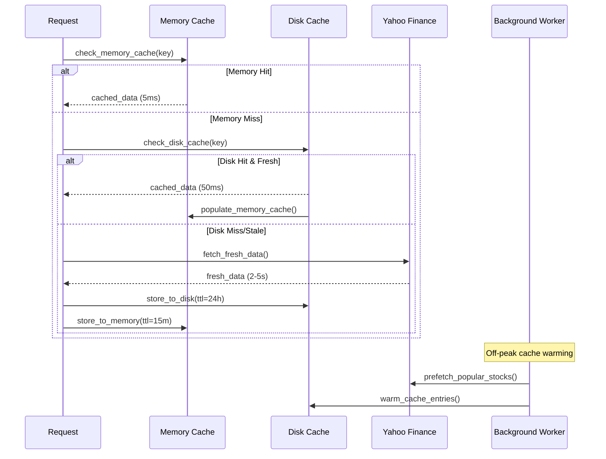

# Service Architecture: Top 5 Sharpe Ratio Application

## Overview

This document defines the service architecture, data flow patterns, and interface contracts for the Top 5 Sharpe Ratio application. The system follows a layered architecture with aggressive caching to meet performance requirements.

## System Architecture Diagram

```
┌─────────────────────────────────────────────────────────────────┐
│                          API Layer                              │
├─────────────────────────────────────────────────────────────────┤
│  FastAPI App  │  Request Models  │  Response Models  │  Health  │
│  (async/await) │  (Pydantic)     │  (Pydantic)      │  Monitor │
└─────────────────────────────────────────────────────────────────┘
                                │
                                ▼
┌─────────────────────────────────────────────────────────────────┐
│                      Business Logic Layer                       │
├─────────────────────────────────────────────────────────────────┤
│   StockRanker    │  PerformanceAnalyzer  │   CacheManager      │
│   (orchestrator)  │  (sharpe calculations)│   (TTL coordination)│
└─────────────────────────────────────────────────────────────────┘
                                │
                                ▼
┌─────────────────────────────────────────────────────────────────┐
│                         Data Layer                              │
├─────────────────────────────────────────────────────────────────┤
│  SP500Loader   │ YahooFinanceAdapter │  DataCache  │  SharpeCalc │
│  (universe)    │ (price fetching)    │ (multi-tier)│ (analytics) │
└─────────────────────────────────────────────────────────────────┘
                                │
                                ▼
┌─────────────────────────────────────────────────────────────────┐
│                      Infrastructure Layer                       │
├─────────────────────────────────────────────────────────────────┤
│   ConfigMgmt   │  BackgroundWorkers │  Monitoring  │  Logging   │
│   (settings)   │  (cache warming)   │ (metrics)    │ (structured)│
└─────────────────────────────────────────────────────────────────┘
```

## Component Responsibilities

### API Layer Components

**FastAPI Application**
- Async request handling with proper error boundaries
- Rate limiting middleware (100 req/min per IP)
- Request/response compression and validation
- OpenAPI documentation generation

**Request/Response Models (Pydantic)**
- Type-safe parameter validation and serialization
- Consistent error response formats
- Auto-generated API documentation schemas

**Health Monitor**
- Cache coverage and hit rate metrics
- External API connectivity status
- Performance threshold monitoring

### Business Logic Layer

**StockRanker**
- Orchestrates the complete ranking workflow
- Coordinates between data fetching and calculations
- Handles pagination and result filtering
- Manages concurrent operations with rate limiting

**PerformanceAnalyzer**
- Sharpe ratio calculations with NaN handling
- Statistical validation and outlier detection
- Risk-adjusted return metrics computation
- Data quality assessment and flagging

**CacheManager**
- Multi-tier cache coordination (memory + disk)
- TTL management and invalidation strategies
- Cache warming and background refresh
- Hit rate optimization and monitoring

### Data Layer Components

**SP500Loader** ✅ (Implemented)
- Static universe loading with validation
- Company metadata and sector classification
- Ticker symbol normalization and validation

**YahooFinanceAdapter**
- Yahoo Finance API integration with retry logic
- Exponential backoff for rate limiting
- Circuit breaker for API failures
- Data transformation and normalization

**DataCache**
- In-memory LRU cache for hot data (200 entries)
- Disk-based Parquet cache for persistence
- Configurable TTL policies by data type
- Cache statistics and monitoring

**SharpeCalculator**
- Vectorized Sharpe ratio computations
- Rolling statistics with proper windowing
- NaN handling and data quality validation
- Annualized return and volatility calculations

## Data Flow Patterns

### Primary Request Flow



### Cache Strategy Flow



## Interface Contracts

### Core Data Models

```python
from dataclasses import dataclass
from typing import List, Optional
from datetime import datetime
from pydantic import BaseModel

@dataclass
class SharpeMetrics:
    """Core performance metrics for a single stock."""
    ticker: str
    name: str
    sector: str
    sharpe_ratio: float
    annualized_return: float
    volatility: float
    data_points: int
    partial: bool = False  # True if <3 years of data
    last_updated: datetime

@dataclass  
class PriceData:
    """Time series price data for calculations."""
    ticker: str
    dates: List[datetime]
    close_prices: List[float]
    adjusted_close: List[float]
    data_quality: float  # 0.0-1.0 completeness score

class TopStocksRequest(BaseModel):
    """Request parameters for top stocks endpoint."""
    count: int = 5
    period: str = "5y"  # 1y, 2y, 5y, 10y
    rf: float = 0.015   # Risk-free rate
    universe: str = "sp500"
    min_data_years: int = 3

class TopStocksResponse(BaseModel):
    """Response format for top stocks endpoint."""
    stocks: List[SharpeMetrics]
    metadata: ResponseMetadata
    execution_time_ms: int
    cache_hit_rate: float

class ResponseMetadata(BaseModel):
    """Response metadata and quality indicators."""
    total_analyzed: int
    filtered_out: int
    data_freshness: datetime
    universe_size: int
    request_id: str
```

### API Endpoint Specifications

**Health Check**
```
GET /health
Response: {
  "status": "ok",
  "version": "1.0.0", 
  "cache_coverage": 0.85,
  "last_data_update": "2024-01-20T15:30:00Z",
  "external_apis": {
    "yahoo_finance": "healthy"
  }
}
```

**Top Stocks Endpoint**
```
GET /api/top-stocks?count=5&period=5y&rf=0.015&universe=sp500

Success (200):
{
  "stocks": [...],
  "metadata": {...},
  "execution_time_ms": 1247,
  "cache_hit_rate": 0.73
}

Error (400/500):
{
  "error": "Invalid parameter",
  "details": "count must be between 1 and 50", 
  "timestamp": "2024-01-20T15:30:00Z",
  "request_id": "req-12345"
}
```

**Price Series Endpoint**
```
GET /api/price-series/AAPL?period=1y

Response:
{
  "ticker": "AAPL",
  "period": "1y",
  "data": [
    {"date": "2023-01-20", "close": 150.23},
    ...
  ],
  "data_quality": 0.98
}
```

## Caching Strategy & Boundaries

### Multi-Tier Cache Architecture

**Level 1: In-Process Memory Cache**
- **Scope**: Recent Sharpe calculations and price data
- **Technology**: Python dict with LRU eviction  
- **Size**: 200 entries max, ~50MB memory
- **TTL**: 5-15 minutes based on market hours
- **Access Time**: <1ms
- **Use Case**: Hot data for repeated queries

**Level 2: Local Disk Cache**  
- **Scope**: Historical price data by ticker/period
- **Technology**: Parquet files with partitioning
- **Location**: `/cache/{ticker}/{period}_{date}.parquet`
- **TTL**: 24 hours (configurable)  
- **Access Time**: 20-100ms
- **Use Case**: Persistent storage across restarts

**Level 3: Precomputed Rankings**
- **Scope**: Popular query combinations  
- **Technology**: JSON files with parameter hashing
- **Location**: `/cache/rankings/top_stocks_{params_hash}.json`
- **TTL**: Market hours dependent (15m trading, 4h off-hours)
- **Access Time**: 5-20ms
- **Use Case**: Instant responses for common queries

### Cache Boundaries & Invalidation

**Cache Key Strategy**
```python
# Price data cache keys
price_key = f"prices:{ticker}:{period}:{start_date}"

# Sharpe calculation cache keys  
sharpe_key = f"sharpe:{ticker}:{period}:{rf_rate}:{data_hash}"

# Ranking cache keys
ranking_key = f"rankings:{universe}:{count}:{period}:{rf_rate}:{min_years}"
```

**Invalidation Triggers**
- **Time-based**: Automatic TTL expiration
- **Data-driven**: New trading day detection
- **Manual**: Admin endpoint for cache clearing
- **Health-based**: Cache corruption detection

## Error Handling & Recovery Patterns

### Network/API Resilience

**Exponential Backoff Strategy**
```python
retry_delays = [1, 2, 4, 8]  # seconds
max_retries = 3
circuit_breaker_threshold = 0.5  # 50% failure rate
```

**Graceful Degradation**
- Return partial results with `partial=true` flag
- Include error context in response metadata
- Maintain service availability with reduced functionality

### Data Quality Management

**Insufficient Data Handling**
- Require minimum 1 year of data for inclusion
- Mark stocks with <3 years as `partial=true`
- Forward-fill missing values with quality scoring

**Outlier Detection**  
- Flag unrealistic price movements (>50% daily change)
- Validate data consistency across time periods
- Exclude obvious data errors from calculations

### System-Level Recovery

**Cache Corruption Recovery**
- Automatic cache rebuilding with validation
- Health check endpoints for cache status
- Progressive cache warming after corruption

**Memory Pressure Management**
- LRU eviction with usage monitoring
- Cache size limits with alerting
- Graceful degradation to disk-only mode

## Performance Requirements & Optimizations

### Target Performance Metrics

| Endpoint | Cold Start | Warm Cache | 95th Percentile |
|----------|------------|------------|-----------------|
| /api/top-stocks | ≤5s | ≤2s | ≤3s |
| /api/price-series | ≤3s | ≤1s | ≤2s |
| /health | N/A | ≤100ms | ≤200ms |

### Optimization Strategies

**Computational Optimizations**
- Vectorized pandas/numpy operations for batch calculations  
- Async/await for concurrent Yahoo Finance API calls
- Early termination strategies (fetch 50+ stocks, return top 5)
- Incremental data updates using timestamp comparison

**I/O Optimizations**  
- HTTP connection pooling for external APIs
- Parquet format for 3-5x faster disk I/O vs CSV
- Column-selective loading to reduce memory usage
- Response compression (gzip) for API endpoints

**Memory Management**
- Object pooling for frequent calculations
- Streaming computations for large datasets  
- Proper cleanup of temporary variables
- Memory-mapped file access for large caches

## Monitoring & Observability

### Key Metrics
- **Performance**: Response times, cache hit rates, calculation throughput
- **Quality**: Data freshness, error rates, partial result frequency  
- **System**: Memory usage, disk usage, external API health
- **Business**: Top stock rankings, sector distribution, volatility trends

### Alerting Thresholds
- Response time >5s (cold) / >2s (warm)
- Cache hit rate <50%
- Error rate >5% 
- External API failures >10%
- Disk usage >80%

This architecture provides the foundation for a scalable, performant, and reliable Top 5 Sharpe Ratio application that meets all specified requirements.